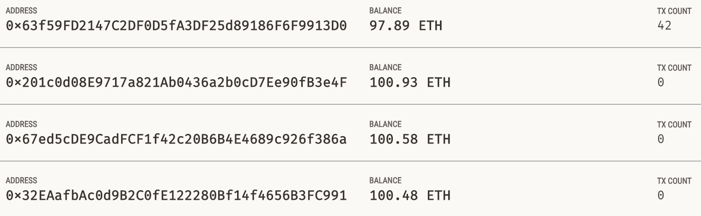
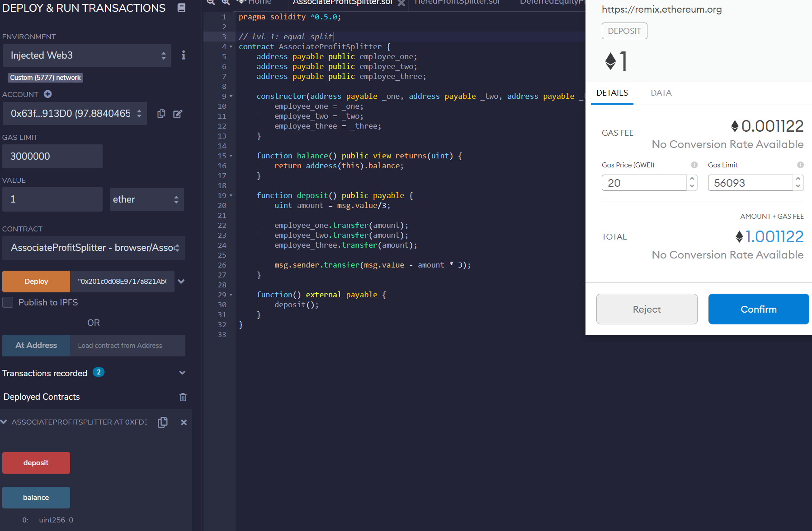
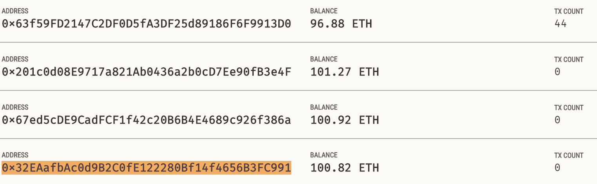
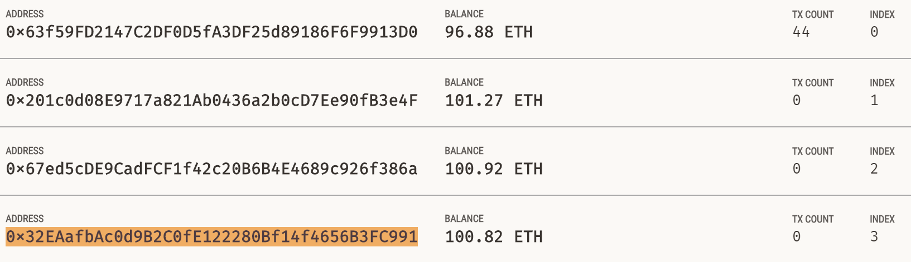
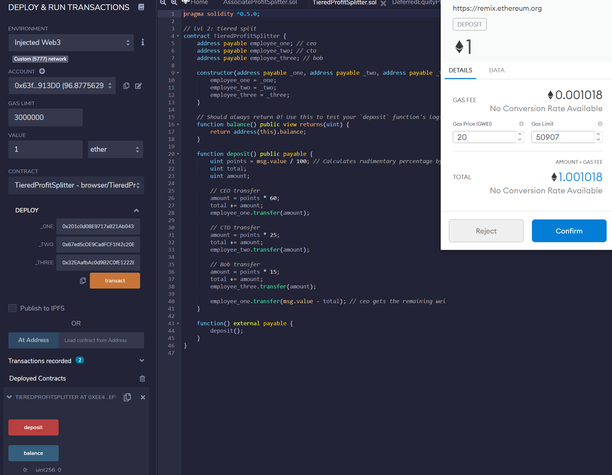
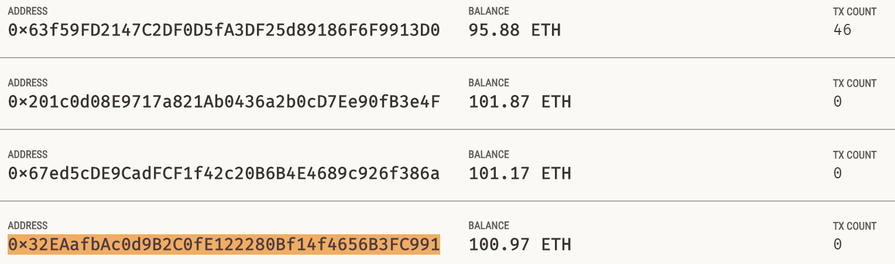
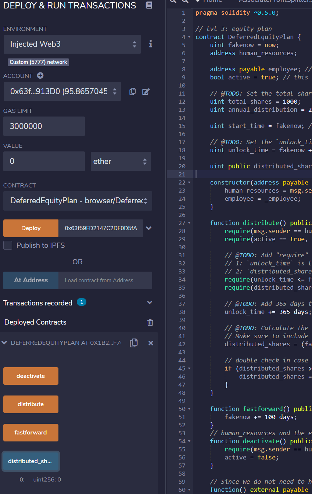
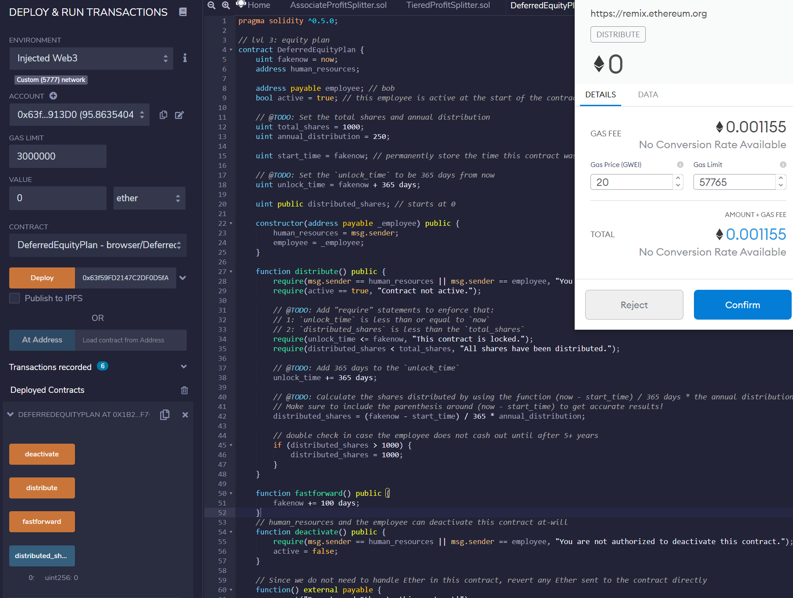
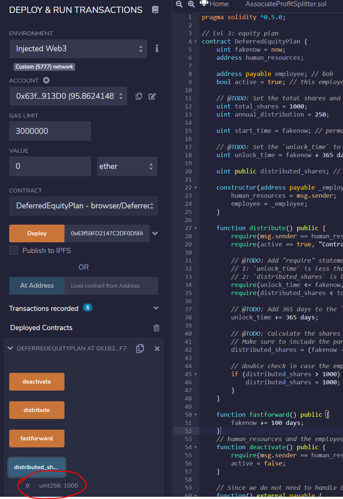

# Solidity_Hmwk_1
This homework demonstrated the basic functionality of solidity. Please find the finished code in the code_files folder.

# Contract 1: AssociateProfitSplitter

This contract will accept Ether into the contract and divide the Ether evenly among the associate level employees. This will allow the Human Resources department to pay employees quickly and efficiently.

### Review of Functions

Balance - Returns the balance of the address of the contract (owner).

Deposit - Deposits the amount of the contract divided by 3 for each of the employees and returns the remainder to the owner.

### Images
The account balances before the transaction.

Contract deployment and use of deposit function.

The account balances post the transaction.

# Contract 2: TieredProfitSplitter

This contract will distribute different percentages of incoming Ether to employees at different tiers/levels.

### Review of Functions

Balance - Returns the balance of the address of the contract (owner).

Deposit - Deposits the amount of the contract multipled by the ratio for each of the employees and returns the remainder to the CEO.

### Images
The account balances before the transaction.

Contract deployment and use of the deposit function.

The account balances post the transaction.

# Contract 3: DeferredEquityPlan

This contract will automatically manage 1000 shares with an annual distribution of 250 over 4 years for a single employee. Note that fakenow is implemented for testing purposes, but in reality this should be replaced with now.

### Review of Functions

Distribute - Distributes equity shares based on a predetermined ratio once the required time threshold has been met. This is tested used the fakenow to fastforward in to the future.

FastForward - To move the time forward 365 days so the functions can be tested.

Deactivate - Allows human resources or employees to deactivate the contract at will.

### Images
Initial deployment of the contract. Note the balance of the shares distributed is zero.

Fastforwarding to demonstrate distribution function.

Final distribution of all shares.
